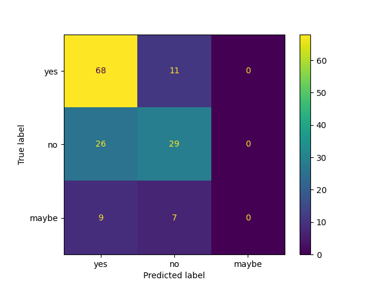
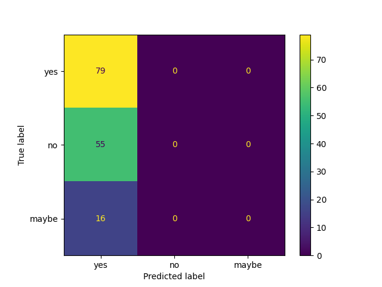

# Fine-tuning PubMedBERT on PubMedQA

This project fine-tunes PubMedBERT (now also known as BiomedBERT) for biomedical question answering using the PubMedQA dataset. A comparison with vanilla BERT-base is included to evaluate the effect of domain-specific pretraining.

## Dataset

PubMedQA is a biomedical question answering dataset where the task is to answer yes/no/maybe given a research context and question.

- Source: `qiaojin/PubMedQA` (pqa_labeled subset)
- Total examples: 1000
- Split: 700 train / 150 validation / 150 test
- Class distribution: yes (55%), no (34%), maybe (11%)

## Why PubMedBERT?

Standard BERT uses a vocabulary trained on Wikipedia and books, which fragments medical terms into meaningless sub-words. For example, "acetyltransferase" becomes multiple unrelated tokens.

PubMedBERT was pretrained on 14 million PubMed abstracts with a domain-specific vocabulary, preserving the semantic meaning of biomedical terminology.

## Input Format

Inputs are formatted as a single sequence for BERT:
```
[CLS] Question [SEP] Context [SEP]
```

This allows the model to learn the relationship between the question and the research abstract.

## Models

- **PubMedBERT**: `microsoft/BiomedNLP-PubMedBERT-base-uncased-abstract-fulltext`
- **BERT-base**: `bert-base-uncased`

## Training Configuration

- Learning rate: 2e-5
- Batch size: 8
- Epochs: 5
- Weight decay: 0.01
- Warmup ratio: 0.1
- Scheduler: linear
- Early stopping: patience 2 (based on F1 macro)

## Results

| Model | Accuracy | F1 Macro | F1 Weighted |
|-------|----------|----------|-------------|
| PubMedBERT | 64.7% | 0.44 | 0.60 |
| BERT-base | 52.7% | 0.23 | 0.36 |

PubMedBERT outperformed BERT-base by 12 percentage points in accuracy and nearly doubled the F1 macro score.

## Confusion Matrices

### PubMedBERT



The model classifies "yes" vs "no" reasonably well but never predicts "maybe".

### BERT-base



The model struggles overall, performing only slightly better than random guessing.

## Observations

- Both models failed to predict the minority class ("maybe"), likely due to class imbalance.
- An experiment with class weighting (train_v2.py) did not improve results — the model still never predicted "maybe", and overall accuracy dropped from 64.7% to 54%. The semantic signal for "maybe" is ambiguous and likely requires more training data than the 700 examples provided.
- Domain-specific pretraining provides clear benefits for biomedical text classification.
  
*Note*: The original PubMedQA paper uses a 450/50/500 train/dev/test split. 
This project uses 700/150/150, so results are not directly comparable 
to published benchmarks, but the relative comparison between models remains valid.

## Usage

Install dependencies:
```bash
pip install -r requirements.txt
```

Preprocess the data:
```bash
python preprocess.py
```

Train PubMedBERT:
```bash
python train.py
```

Train BERT-base:
```bash
python train_bert.py
```

## Files

- `preprocess.py`: Downloads and preprocesses the dataset
- `train.py`: Fine-tunes PubMedBERT
- `train_v2.py`: Fine-tunes PubMedBERT with class weighting (experimental)
- `train_bert.py`: Fine-tunes BERT-base
- `requirements.txt`: Dependencies


## References

- PubMedQA: Jin et al., "PubMedQA: A Dataset for Biomedical Research Question Answering" (2019)
- PubMedBERT: Gu et al., "Domain-Specific Pretraining for Biomedical Natural Language Processing" (2020)
- Amit, "Fine-Tuning BERT for Classification: A Practical Guide", Medium. https://medium.com/@heyamit10/fine-tuning-bert-for-classification-a-practical-guide-b8c1c56f252c
- Pai, S. "Designing Large Language Model Applications: A Holistic Approach to LLMs". O'Reilly Media.
